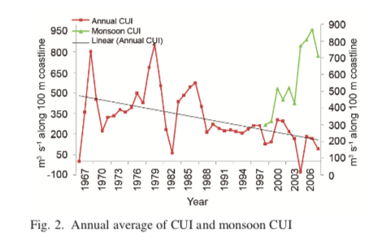

```{r setup, include=FALSE}
knitr::opts_chunk$set(echo = FALSE, warning=FALSE, message=FALSE)
source(file.path(here::here(), "inst", "extdata", "get_satellite_data", "Replicate_EMT", "get_EMT_functions.R"))
load(file.path(here::here(), "inst", "extdata", "get_satellite_data", "Replicate_EMT", "indiashp.RData"))
coastangle <- 140
library(ggplot2)
library(tidyr)
library(dplyr)
library(raster)
library(rasterVis)
library(plotrix)
```

This report compares the 6-hrly and montly FNMOC products. The documentation states that the monthly data is computed from the 6-hr data but something is off for 1982 to 1996 and those numbers are different. In the paper, the monthly dataset is used which is also used by Supraba et al 2016 and Manjusha et al 2019. Suprada et al use lat 13N lon 74.5E with a coast angle of 158 degrees while Manjusha et al state that they use lat 8.5N lon 76.6 (approx) with a coast angle of 140 or 133 degrees (both numbers given). However using those numbers, I cannot replicate their figure 2 and ERD does not give EMT or winds for latitudes below 11N. I can replicate their figure 2 with lat 11.5N lon 75.5 with coast angle 140 (not sensitive to coast angle). So in the paper I use that.

Keep in mind that the land is masked some years and not others.

```{r eval=FALSE}
# Download the 6=hr data
for(i in 1970:2019){
  cat(i, "\n")
  dates <- c(paste0(i,"-01-01"), paste0(i+1,"-01-01"))
  a <- getdata("erdlasFnPres6", date=dates, lat=c(7,15), lon=c(70,78))
}
```

```{r warning=FALSE, message=FALSE}
# Download the 6=hr data
rawFNMOC <- data.frame()
for(i in 1970:2018){
  dfil <- paste0("erdlasFnPres6", "-7-15-70-78-", i, "-01-01-", i+1, "-01-01.csv")
  a <- read.csv(file.path(here::here(), "inst", "extdata", "get_satellite_data", "Replicate_EMT", dfil))
  a <- a[-1,]
  a$date <- as.Date(a$time)
  a$Month <- as.numeric(format(a$date, "%m"))
  a$Year <- as.numeric(format(a$date, "%Y"))
  a <- subset(a, Year==i)
  a$p_msl <- as.numeric(a$p_msl)
  a$p_msl[a$p_msl< 100 | a$p_msl > 2000] <- NA
  a$latitude <- as.numeric(a$latitude)
  a$longitude <- as.numeric(a$longitude)
  attr(a, "resolution") <- diff(sort(unique(a$latitude)))[1]
  a <- getwindfromP(a)
  a <- getEMT(a, coast_angle=coastangle)
  a.mon <- a %>% 
  group_by(Year, Month, latitude, longitude) %>% 
  summarize(
    u_mean = mean(u, na.rm=TRUE), 
    v_mean = mean(v, na.rm=TRUE),
    uv_mag_mean = mean(uv_mag, na.rm=TRUE),
    taux_mean = mean(taux, na.rm=TRUE),
    tauy_mean = mean(tauy, na.rm=TRUE),
    ektrx = mean(ektrx, na.rm=TRUE),
    ektry = mean(ektry, na.rm=TRUE),
    pmsl = mean(p_msl, na.rm=TRUE)
    )
  rawFNMOC <- rbind(rawFNMOC, a.mon)
}
rawFNMOC$date <- as.Date(paste0(rawFNMOC$Year,"-",rawFNMOC$Month,"-16"))
rawFNMOC$EMTperp <- EMTperp(rawFNMOC$ektrx, rawFNMOC$ektry, coastangle)$perp

```
  
  
```{r}
dates <- c("1970-01-01", "2019-01-01")
lats=c(7,15); lons=c(70,78)
FNMOC <- getdata("erdlasFnWPr", date=dates, lat=lats, lon=lons)
FNMOC$date <- as.Date(FNMOC$time)
FNMOC$Month <- as.numeric(format(FNMOC$date, "%m"))
FNMOC$Year <- as.numeric(format(FNMOC$date, "%Y"))
FNMOC$ektrx[FNMOC$ektrx< -50000] <- NA
FNMOC$ektrx[FNMOC$ektrx==0] <- NA
FNMOC$ektrx[FNMOC$ektry==0] <- NA
FNMOC$ektry[FNMOC$ektry< -50000] <- NA
for(i in c(7.5, 8.5, 9.5)){
  for(j in c("ektrx", "ektry", "u_mean", "v_mean", "u_mean"))
FNMOC[[j]][FNMOC$latitude == i] <- NA
}
FNMOC$EMTperp <- EMTperp(FNMOC$ektrx, FNMOC$ektry, coastangle)$perp

```


Whether or not the land is masked varies so make sure to only use points over water.

For the years 1970 to 1980, the calculations in the monthly ERD product are the means of the 6-hour data. Plot shown for one point but it is similar across other points.


```{r}
cols <- c("date","Month", "latitude","longitude","Year", "u_mean", "v_mean", "ektrx", "ektry", "pmsl", "EMTperp")
df1 <- pivot_longer(rawFNMOC[,cols], 
                   !c("date","latitude","longitude","Year", "Month"),
                   names_to = "variable",
                   values_to = "value.6hr")
df2 <- pivot_longer(FNMOC[,cols], 
                   !c("date","latitude","longitude","Year", "Month"),
                   names_to = "variable",
                   values_to = "value.mon")
df <- cbind(df1, value.mon=df2$value.mon)

df2 <- subset(df, latitude==11.5 & longitude==75.5)

ggplot(subset(df2, Year%in%c(1970:1980, 1997:2018)), aes(x=value.6hr, y=value.mon)) + geom_point() + facet_wrap(~variable, scales="free")
```

However for 1981 to 1996, the v wind calculation is quite different. The mean pressure values are very similar but the v wind is different. Shown for one point but similar for other latitudes and longitudes.

```{r}
ggplot(subset(df2, Year%in%c(1981:1996)), aes(x=value.6hr, y=value.mon)) + geom_point() + facet_wrap(~variable, scales="free")
```

```{r}
ggplot(subset(df2, variable=="v_mean" & Year%in%c(1981:1996)), aes(x=value.6hr, y=value.mon)) + geom_point() + facet_wrap(~Year)
```

```{r}
df3 <- pivot_longer(df, 
                   !c("date","latitude","longitude","Year", "Month", "variable"),
                   names_to = "dataset",
                   values_to = "value")
monthly.means <- df3 %>% 
  group_by(Month, latitude, longitude, variable, dataset) %>% 
  summarize(
    mean = mean(value, na.rm=TRUE)
    )
```

Monthly means for all the variables.

```{r}
val <- subset(monthly.means, latitude==11.5 & longitude==75.5)
ggplot(val, aes(x=Month, y=mean, col=dataset)) + geom_line() + facet_wrap(~variable, scales="free")
```

Differences in monthly means across years.

```{r}
ggplot(subset(df3, variable=="v_mean" & latitude==11.5 & longitude==75.5), 
       aes(x=Month, y=value, col=dataset)) + geom_line() + facet_wrap(~Year)
```

Here are the values for July at latitude 11.5 and longitude 75.5.

```{r}
ggplot(subset(df3, latitude==11.5 & longitude==75.5 & Month==7), 
       aes(x=Year, y=value, col=dataset)) + geom_line() + facet_wrap(~variable, scales="free", ncol=2)
```


Here are the values for July at different latitudes.

```{r}
ggplot(subset(df3, variable%in%c("EMTperp", "u_mean", "v_mean") & ((latitude %in% c(8.5, 9.5,10.5) & longitude==75.5) | (latitude == 11.5 & longitude==74.5)) & Month==7 & dataset=="value.6hr"), 
       aes(x=Year, y=value, col=as.factor(latitude))) + geom_line() + facet_wrap(~variable, scales="free", ncol=1)
```

# Try to replicate Figure 2 in Manjusha et al 2019



The text says it uses the ERD upwelling index at latitude 8.5N and longitude 76.5E approx. But that doesn't seem right.

```{r}
lat = 8.5
lon = 76.5
df4 <- subset(df3, Month %in% 1:12 & variable=="EMTperp" & dataset=="value.6hr") %>% 
  group_by(Year, latitude, longitude) %>% 
  summarize(
    EMTperp = mean(value, na.rm=TRUE)
    )
df5 <- subset(df3, Month %in% 6:9 & variable=="EMTperp" & dataset=="value.6hr") %>% 
  group_by(Year, latitude, longitude) %>% 
  summarize(
    EMTperp = mean(value, na.rm=TRUE)
    )
ggplot(subset(df4, latitude == lat & longitude== lon), 
       aes(x=Year, y=-1*EMTperp/10)) + geom_line() + geom_point() + xlim(c(1967,2006)) + 
  geom_line(data=subset(df5, latitude == lat & longitude==lon & Year>1996), aes(x=Year, y=-1*EMTperp/10), col="green") + 
  geom_point(data=subset(df5, latitude == lat & longitude==lon & Year>1996), aes(x=Year, y=-1*EMTperp/10), col="green") + 
  ggtitle(paste("Lat", lat, "Lon", lon, "coast angle", coastangle))
```


While at latitude 11.5 and longitude 75.5, it appear fairly similar. The scales are very similar. Mine is kg/ms while theirs is m3/s over 100m of coastline and the sign is reversed. So to translate to the same scale -1 x my.number kg/ms x 100m / 1029 kg/m3 = m3/s over 100m of coastline. The density of sea water is 1029 kg/m3. The thin grey line is the averages from the 6 hour data, but they used the monthly data from ERD. As noted above I don't know why 1982 to 1996 is different than the 6-hour averages. It is unclear what coast angle they used. They give both 140 and 133, which would be roughly that near 11.5 degrees latitude.

```{r}
lat = 11.5
lon = 75.5
df4 <- subset(df3, Month %in% 1:12 & variable=="EMTperp" & dataset=="value.mon") %>% 
  group_by(Year, latitude, longitude) %>% 
  summarize(
    EMTperp = mean(value, na.rm=TRUE)
    )
df4.6 <- subset(df3, Month %in% 1:12 & variable=="EMTperp" & dataset=="value.6hr") %>% 
  group_by(Year, latitude, longitude) %>% 
  summarize(
    EMTperp = mean(value, na.rm=TRUE)
    )
df5 <- subset(df3, Month %in% 6:9 & variable=="EMTperp" & dataset=="value.mon") %>% 
  group_by(Year, latitude, longitude) %>% 
  summarize(
    EMTperp = mean(value, na.rm=TRUE)
    )
ggplot(subset(df4, latitude == lat & longitude== lon), 
       aes(x=Year, y=-1*100*EMTperp/1029)) + geom_line() + geom_point() + xlim(c(1967,2007)) + 
  geom_line(data=subset(df4.6, latitude == lat & longitude==lon), aes(x=Year, y=-1*EMTperp/10), col="grey") +
  geom_line(data=subset(df5, latitude == lat & longitude==lon & Year>1997), aes(x=Year, y=-1*EMTperp/10), col="green") + 
  geom_point(data=subset(df5, latitude == lat & longitude==lon & Year>1997), aes(x=Year, y=-1*EMTperp/10), col="green") + 
  ggtitle(paste("Lat", lat, "Lon", lon, "coast angle", coastangle))
```


Confirm that upw in the SardineForecast package is this.

```{r}
lat = 11.5
lon = 75.5
df4 <- subset(df3, Month %in% 7 & variable=="EMTperp" & dataset=="value.mon") %>% 
  group_by(Year, latitude, longitude) %>% 
  summarize(
    EMTperp = mean(value, na.rm=TRUE)
    )
ggplot(subset(df4, latitude == lat & longitude== lon), 
       aes(x=Year, y=-1*EMTperp/10)) + geom_line() + geom_point() + xlim(c(1967,2007)) + 
  geom_line(data=subset(upw, Month==7), aes(x=Year, y=Bakun.UPW), col="green") + 
  ggtitle(paste("Lat", lat, "Lon", lon, "coast angle", coastangle))
```