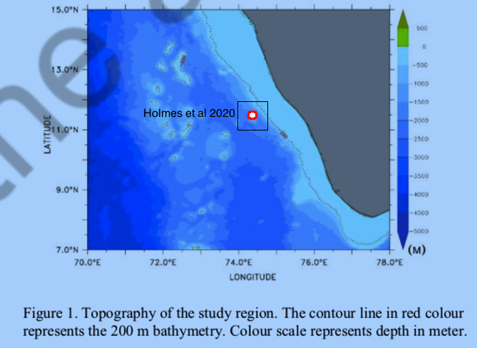
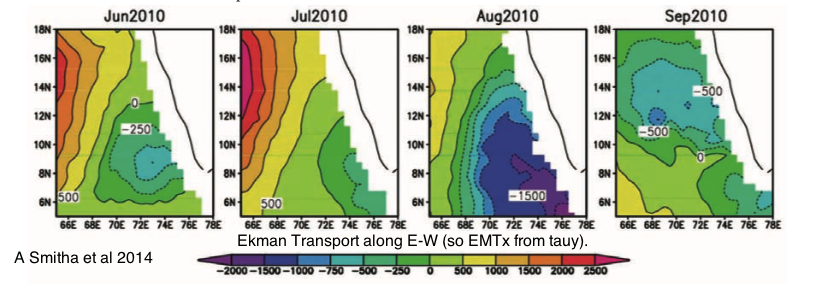
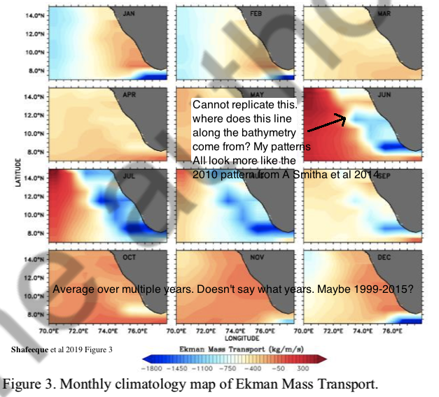
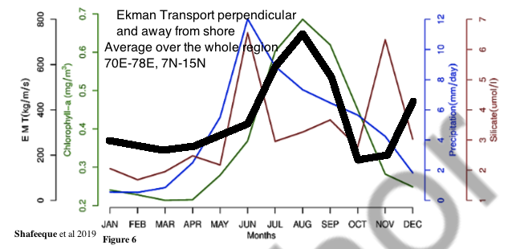

```{r setup, include=FALSE}
knitr::opts_chunk$set(echo = FALSE, dpi=72)
source(file.path(here::here(), "inst", "extdata", "get_satellite_data", "Replicate_EMT", "get_EMT_functions.R"))
library(ggplot2)
library(tidyr)
library(dplyr)
library(raster)
library(rasterVis)
```

Here I attempt to replicate the Ekman Mass Transport (EMT) figures in Smitha A et al 2014 and Shafeeque et al (2019). Shafeeque et al show a correlation between Ekman Mass Transport and chlorophyll during summers with unusually high precipitation. They argue that both high upwelling and high river discharge is necessary for high chlorophyll concentration during summer. Shafeeque et al cite Smitha A et al for their EMT calculations and both use wind estimates from satellite scatterometer data. I used an EMT calculation in the sardine paper but it differed from that in Shafeeque et al in two ways:

* It used wind estimated from the FNMOC pressure field data not scatterometer data.
* It used the EMT calculation for a 1 degree box centered at 11.5 latitude and 74.5 degree longitude versus the region-wide EMT average 7-15 degree latitude and 70-78 degree latitude used in Shafeeque et al.



The selection of the location to use for Holmes et al 2020 upwelling measurement was influenced by the Bakun upwelling indices for the US west coast, which use a similiar approach. A location more southerly towards 9.5 latitude would have corresponded better with the region of high upwelling but the EMT data I downloaded only reports values to 11.5 degree latitude because it is based on pressure data and the wind calculation is not accurate close to the equator.

The reviewer criticism that our paper did not use EMT as an index of upwelling was not correct, the Bakun upwelling index (Schwing et al 1996) is based on EMT, but I think it is a fair criticism that I computed the EMT using wind estimates from pressure data rather than from scatterometer data. The reason for this was that the scatterometer data only go back to 1997 while the pressure data go back to 1967. Here I try to replicate the key EMT figures from Shafeeque et al so that I can try including the same EMT covariate that they do.

However I have some questions:

* Does using an average EMT over a large region make sense up to 5 degrees offshore make sense?
* Should I use $EMT_x$ (east-west) or EMT perpendicular to the coastline. Shafeeque et al use $\tau_y$ in their equations, implying they use $EMT_x$ but I cannot replicate their figures with $EMT_x$ but can (almost) with EMT perpendicular to the coast.
* Should I include the upwelling zone below the tip of India?


# Replicate figure 3b in Smitha et al 2014

First step is to replicate the EMT figure in Smitha et al 2014 to show that I am computing everything similarly. This is $EMT_x$ for Jun-Sep 2010. The scatterometer data are a little different (different source) but same type of instrument. Smitha et al use scatterometer data from Oceansat-II, an Indian satellite. I (and Shafeeque et al) use scatterometer data from the EUMETSAT's Metop satellites.



```{r echo=FALSE, eval=FALSE}
indiashp <- raster::getData("GADM", country = "India", level = 0)
indiashp2 <- crop(indiashp, extent(66,78,5,18))
indiashp2 <- crop(indiashp, extent(65,79,5,19))
save(indiashp, indiashp2, file="indiashp.RData")
```

```{r echo=FALSE}
load(file.path(here::here(), "inst", "extdata", "get_satellite_data", "Replicate_EMT", "indiashp.RData"))
```

Get the data and compute EMT.
```{r getdata}
dates <- c("2010-01-01", "2011-01-01")
lats <- c(5, 18); lons <- c(66,78)
windmon2 <- getdata("erdQAwindmday", date=dates, lat=lats, lon=lons, altitude=10)
windmon2$u <- windmon2$x_wind
windmon2$v <- windmon2$y_wind
windmon2$year <- format(windmon2$time, "%Y")
windmon2$date <- format(windmon2$time, "%Y-%m-01")
windmon2$month <- months(windmon2$time)
res <- attr(windmon2, "resolution")
windmon2 <- getEMT(windmon2, coast_angle=158)
```

Smitha et al 2014 states that they compute upwelling associated EMT from the north-south wind stress ($\tau_y$). In the plot, the red contour is $EMT_x = 0$ and blue contour is $EMT_x = -1000$ (kg/ms). The plots are very similar to Figure 3b in Smitha et al shown above.
```{r r2010plot}
pal <- colorRampPalette(c("red", "yellow", "green", "blue", "purple"))
r2010 <- stack()
for(i in paste0("2010-0", 6:9, "-01")){
pal <- colorRampPalette(c("red", "yellow", "green", "blue", "purple"))
rdf <- subset(windmon2, date==i)
rdf$x <- rdf$longitude
rdf$y <- rdf$latitude
rdf <- rdf[, c("x", "y", "u", "v", "taux", "tauy", "ektrx", "ektry", "upi")]
rst <- rasterFromXYZ(rdf)
r <- rst[["ektrx"]]
names(r) <- format(as.Date(i), "%b-%Y EMTx")
r2010 <- stack(r2010, r)
}
m <- rbind(c(1, 2), c(3, 4))
layout(m)
par(mar=c(2,5,2,5))

for(i in 1:4){
  plot(extent(c(65,78,5,18)), main=names(r2010[[i]]), type="n", xlab="", ylab="")
  plot(r2010[[i]], col=rev(pal(20)), zlim=c(-2500,2500), add=TRUE)
  contour(r2010[[i]], add=TRUE, levels=c(0,-1000), col=c("red","black"), lwd=2)
  plot(indiashp2, add=TRUE)
}
```
The wind vector field for August 2010 shown below.
```{r wind2010plot}
field <- subset(windmon2, date=="2010-08-01")[, c("longitude", "latitude", "u", "v")]
field <- rasterFromXYZ(field)
vectorplot(field, isField='dXY', region = FALSE, margin = FALSE, narrows = 100, length=unit(2e-2, 'npc'), main="Winds August 2010") +  layer(sp.polygons(indiashp))
```

The Bakun upwelling index uses the EMT that is perpendicular to the coast. Since the SW coast of India is not vertical, some component of $EMT_y$ (north-south) is perpendicular to the coast. The plot for the EMT perpendicular to the coast is quite different which shows that Smitha et al 2014 indeed used $EMT_x$ as the upwelling index.

```{r EMTperp2010plot}
pal <- colorRampPalette(c("red", "yellow", "green", "blue", "purple"))
r2010 <- stack()
for(i in paste0("2010-0", 6:9, "-01")){
pal <- colorRampPalette(c("red", "yellow", "green", "blue", "purple"))
rdf <- subset(windmon2, date==i)
rdf$x <- rdf$longitude
rdf$y <- rdf$latitude
rdf <- rdf[, c("x", "y", "u", "v", "taux", "tauy", "ektrx", "ektry", "EMTperp")]
rst <- rasterFromXYZ(rdf)
r <- rst[["EMTperp"]]
names(r) <- format(as.Date(i), "%b-%Y EMT perpendicular")
r2010 <- stack(r2010, r)
}
m <- rbind(c(1, 2), c(3, 4))
layout(m)
par(mar=c(2,5,2,5))

for(i in 1:4){
  plot(extent(c(65,78,5,18)), main=names(r2010[[i]]), type="n", xlab="", ylab="")
  plot(r2010[[i]], col=rev(pal(20)), zlim=c(-2500,2500), add=TRUE, zlimcol="black")
  contour(r2010[[i]], add=TRUE, levels=c(0,-1000), col=c("red","black"), lwd=2)
  plot(indiashp2, add=TRUE)
}
```

# Shafeeque et al 2019

Try to replicate Figure 3 and Figure 6 in Shafeeque et al 2019. I downloaded the monthly QSCAT and ASCAT data (used in Shafeeque et al 2019) from the [CoastWatch ERDDAP server](https://coastwatch.pfeg.noaa.gov/erddap). Data sets were QSCAT (0.125 degree grid): `erdQSwindmday` and ASCAT (0.25 deg grid): `erdQAwindmday`. The bounding box was 7-15 degrees latitude and 70-78 degrees longitude. The data has land points masked (replaced with NA). In early years the mask extended away from the coast a bit (like 0.25 degrees) while in later years, it hugs the coast. In one month, the land is not masked. I fixed that by re-applying a land maskfor all months and years. The QSCAT data were subsampled (not averaged) to the latitudes and longitudes in the ASCAT data.

```{r getwindall, echo=FALSE, warning=FALSE}
dates <- c("1999-08-16", "2009-10-16")
lats <- c(7, 15); lons <- c(70,78)
qscat <- getdata("erdQSwindmday", date=dates, lat=lats, lon=lons, altitude=10)
dates <- c("2009-11-16", "2017-01-16")
ascat <- getdata("erdQAwindmday", date=dates, lat=lats, lon=lons, altitude=10)
#masking varies. Use mask from Sept 2015
tmp <- subset(ascat, as.Date(ascat$time)=="2015-09-16")
india.mask <- tmp[is.na(tmp$y_wind),c("latitude", "longitude")]
in.mask <- paste(ascat$latitude, ascat$longitude) %in% paste(india.mask$latitude, india.mask$longitude)
ascat[in.mask, c("x_wind", "y_wind")] <- NaN
qscat <- qscat[qscat$latitude %in% unique(ascat$latitude),]
qscat <- qscat[qscat$longitude %in% unique(ascat$longitude),]
qscat[in.mask, c("x_wind", "y_wind")] <- NaN
windmon3 <- rbind(qscat, ascat)
# There are some erroneous y_wind values
windmon3$y_wind[windmon3$y_wind>10] <- NaN
windmon3$date <- as.Date(windmon3$time)
windmon3$u <- windmon3$x_wind
windmon3$v <- windmon3$y_wind
windmon3$year <- format(windmon3$time, "%Y")
windmon3$date <- format(windmon3$time, "%Y-%m-01")
windmon3$month <- months(windmon3$time)
res <- attr(ascat, "resolution")
windmon3 <- getEMT(windmon3, coast_angle=158)
```


```{r windmon3.mean, echo=FALSE, warning=FALSE}
windmon3.mean <- windmon3 %>% 
  group_by(month, latitude, longitude) %>% 
  summarize(ektrx = mean(ektrx, na.rm=TRUE), 
            ektry = mean(ektry, na.rm=TRUE),
            tauy = mean(tauy, na.rm=TRUE),
            upi = mean(upi, na.rm=TRUE),
            v = mean(v, na.rm=TRUE),
            u = mean(u, na.rm=TRUE),
            EMT = mean(EMT, na.rm=TRUE),
            EMTperp = mean(EMTperp, na.rm=TRUE),
)
```

## Figure 3

First I try to replicate Figure 3 which is a spatial map of the monthly mean EMT. The equations in the text use $\tau_y$, implying that like in Smitha et al 2014, they use $EMT_x$. But the text says "... where $\tau_y$ is the alongshore wind stress" suggesting that they rotated the wind stress vector to be parallel to the coast. This suggest that they used $EMT$ perpendicular to the coast rather than $EMT_x$. As seen in the previous plots, these are quite different.

In Figure 3, I add some notes regarding the part of the figure that I am unable to replicate. I made a guess that the plot is averaging all years (1999-2015) but they don't explicitly say what years were averaged for this plot. The color scale goes through white at about $EMT=-500$.


```{r rst, echo=FALSE, warning=FALSE}
for(i in month.name){
rdf <- subset(windmon3.mean, month==i)
rdf$x <- rdf$longitude
rdf$y <- rdf$latitude
rdf <- rdf[, c("x", "y", "EMTperp")]
if(i=="January"){ rst <- rasterFromXYZ(rdf); names(rst) <- i }else{
  tmp <- rasterFromXYZ(rdf); names(tmp) <- i
  rst <- stack(rst, tmp)
}
}
```

```{r eval=FALSE}
m <- matrix(1:12,4,3)
layout(m)
par(mar=c(2,6,2,6), oma=c(0,0,0,0))
at=seq(-3000,1000,250)
for(i in 1:12){
  plot(extent(c(70,78,7,15)), main=names(rst[[i]]), type="n", xlab="", ylab="")
  plot(rst[[i]], col = rev(pal(100)), xlab = "", ylab = "", 
       zlim=c(min(at), max(at)), add=TRUE, legend=FALSE)
  contour(rst[[i]], add=TRUE, levels=c(0,-1000), col=c("red", "black"), lwd=2)
  plot(indiashp, add=TRUE)
}
mtext("Ekman Transport Perpendicular to Coast", outer=TRUE, line=1)

# par(oma=c(0,0,2,0))
# pal <- colorRampPalette(c("red", "orange", "white", "lightblue", "blue", "black"))
# plot(rst, col = rev(pal(100)), xlab = "Longitude", ylab = "Latitude", zlim=c(-2000*1.3,300*1.3))
# mtext("Ekman Transport Perpendicular to Coast", outer=TRUE, line=1)

```

Here is my attempt to replicate their figure 3 using EMT perpendicular to the coast. I set my scale to go through white at $EMT = -500$ also. The image is mostly similar to their Figure 3 but the sudden shift from blue to red in June and July parallel to the coast is not there at all.

```{r windmon3.mean.plot, echo=FALSE, warning=FALSE}
for(i in month.name){
rdf <- subset(windmon3.mean, month==i)
rdf$x <- rdf$longitude
rdf$y <- rdf$latitude
rdf <- rdf[, c("x", "y", "EMTperp")]
if(i=="January"){ rst <- rasterFromXYZ(rdf); names(rst) <- i }else{
  tmp <- rasterFromXYZ(rdf); names(tmp) <- i
  rst <- stack(rst, tmp)
}
}
at=seq(-3000,2000,100)
pal <- colorRampPalette(c("red","white","blue"))
spplot(rst, col.regions=rev(pal(length(at))), at=at, zlim=c(-3000,500),
       main="Average Monthly EMT perp to coast (+ in, - out)") + layer(sp.polygons(indiashp2))
```


I also tried $EMT_x$ (east-west EMT). That image also has similarities to their Figure 3 but still lacks that sudden blue to red shift in their June and July images.

```{r windmon3.mean.EMTx.plot, echo=FALSE, warning=FALSE}
for(i in month.name){
rdf <- subset(windmon3.mean, month==i)
rdf$x <- rdf$longitude
rdf$y <- rdf$latitude
rdf <- rdf[, c("x", "y", "ektrx")]
if(i=="January"){ rstew <- rasterFromXYZ(rdf); names(rstew) <- i }else{
  tmp <- rasterFromXYZ(rdf); names(tmp) <- i
  rstew <- stack(rstew, tmp)
}
}
at=seq(-3000,2000,100)
pal <- colorRampPalette(c("red","white","blue"))
spplot(rstew, col.regions=rev(pal(length(at))), at=at, zlim=c(-3000,500),
       main="Average Monthly EMT East(+) West(-)") + layer(sp.polygons(indiashp2))
```


```{r windplots}
plist=list()
for(i in 1:12){
  field <- subset(windmon3.mean, month==month.name[i])[, c("longitude", "latitude", "u", "v")]
  field <- rasterFromXYZ(field)
  p1 <- vectorplot(field, isField='dXY', region = FALSE, margin = FALSE, narrows = 100, length=unit(3e-2, 'npc'), main=month.name[i]) +  layer(sp.polygons(indiashp2))
  plist[[month.name[i]]] <- p1
}
```

Here are the winds.

```{r echo=FALSE}
gridExtra::grid.arrange(grobs=plist[1:3], ncol=3)
```
```{r echo=FALSE}
gridExtra::grid.arrange(grobs=plist[4:6], ncol=3)
```
```{r echo=FALSE}
gridExtra::grid.arrange(grobs=plist[7:9], ncol=3)
```
```{r echo=FALSE}
gridExtra::grid.arrange(grobs=plist[10:12], ncol=3)
```

## Figure 6

Figure 6 in Shafeeque et al (2019) shows the mean EMT by month. I have highlighted the EMT line that I am trying to replicate. They have switched the sign of the EMT so that positive is more upwelling (EMT away from coast).



Mean Ekman Transport perpendicular to coast line.

```{r mean.monthly.EMTp, echo=FALSE}
plot(tapply(-1*windmon3.mean$EMTperp, windmon3.mean$month, mean, na.rm=TRUE)[month.name], type="l",
     main="Mean Ekman Transport Perp to Coast 1999-2017 (+ = offshore)", ylab="-1 x EMT perp (kg/ms)", xlab="month",
     xaxt="n")
axis(1, at=1:12, labels=month.abb)
```

It is clear that they did not use the average $EMT_x$ however, at least not averaged over the whole area.

```{r meanmonthly.EMTx}
plot(tapply(-1*windmon3.mean$ektrx, windmon3.mean$month, mean, na.rm=TRUE)[month.name], type="l",
     main="Mean Ekman Transport East-West 1999-2017 (+ = offshore)", ylab="-1 x EMT_x (kg/ms)", xlab="month",
     xaxt="n")
axis(1, at=1:12, labels=month.abb)
```

## Nearshore EMT

Perhaps they used only the nearshore EMT? No that does not seem to help.

```{r}
load(file.path(here::here(), "inst", "extdata", "get_satellite_data", "Replicate_EMT", "indiashp.RData"))
b=as(as(indiashp2, "SpatialLinesDataFrame"), "SpatialPointsDataFrame")
b=subset(b, Line.NR==129)
coastcoord=coordinates(b)
coastcoord <- coastcoord[coastcoord[,"x"]<77.5,]
coastlats = unique(windmon3.mean$latitude)
coastlons = c()
for(i in coastlats){
  tmp <- coastcoord[,"y"]
  coastlons <- c(coastlons, min(coastcoord[,"x"][which(abs(tmp-i)==min(abs(tmp-i)))]))
}
```

```{r windmon3.coast, echo=FALSE, warning=FALSE}
windmon3.coast <- windmon3[windmon3$latitude>7,]
for(i in 1:length(coastlats)){
  thelat <- coastlats[i]
  thelon <- coastlons[i]
  windmon3.coast <- windmon3.coast[!(windmon3.coast$latitude==thelat & windmon3.coast$longitude<(thelon-2)),]
}
windmon3.cmean <- windmon3.coast %>% 
  group_by(month, latitude, longitude) %>% 
  summarize(ektrx = mean(ektrx, na.rm=TRUE), 
            ektry = mean(ektry, na.rm=TRUE),
            upi = mean(upi, na.rm=TRUE),
            v = mean(v, na.rm=TRUE),
            u = mean(u, na.rm=TRUE),
            EMT = mean(EMT, na.rm=TRUE),
            EMTperp = mean(EMTperp, na.rm=TRUE)
)
```

```{r windmon3.coast.plot, echo=FALSE, warning=FALSE}
for(i in month.name){
rdf <- subset(windmon3.cmean, month==i)
rdf$x <- rdf$longitude
rdf$y <- rdf$latitude
rdf <- rdf[, c("x", "y", "EMTperp")]
if(i=="January"){ rst <- rasterFromXYZ(rdf); names(rst) <- i }else{
  tmp <- rasterFromXYZ(rdf); names(tmp) <- i
  rst <- stack(rst, tmp)
}
}
at=seq(-3000,2000,100)
pal <- colorRampPalette(c("red","white","blue"))
spplot(rst, col.regions=rev(pal(length(at))), at=at, zlim=c(-3000,500),
       main="Average Monthly EMT perp to coast (+ in, - out)") + layer(sp.polygons(indiashp2))
```


```{r windmon3.coast.EMTx.plot, echo=FALSE, warning=FALSE}
for(i in month.name){
rdf <- subset(windmon3.cmean, month==i)
rdf$x <- rdf$longitude
rdf$y <- rdf$latitude
rdf <- rdf[, c("x", "y", "ektrx")]
if(i=="January"){ rstew <- rasterFromXYZ(rdf); names(rstew) <- i }else{
  tmp <- rasterFromXYZ(rdf); names(tmp) <- i
  rstew <- stack(rstew, tmp)
}
}
at=seq(-3000,2000,100)
pal <- colorRampPalette(c("red","white","blue"))
spplot(rstew, col.regions=rev(pal(length(at))), at=at, zlim=c(-3000,500),
       main="Average Monthly EMT East(+) West(-)") + layer(sp.polygons(indiashp2))
```


Mean Ekman Transport perpendicular to coast line.

```{r echo=FALSE}
plot(tapply(-1*windmon3.cmean$EMTperp, windmon3.cmean$month, mean, na.rm=TRUE)[month.name], type="l",
     main="Mean Ekman Transport Perp to Coast 1999-2017 (+ = offshore)", ylab="-1 x EMT perp (kg/ms)", xlab="month",
     xaxt="n")
axis(1, at=1:12, labels=month.abb)
```


Mean Ekman Transport east-west.

```{r echo=FALSE}
plot(tapply(-1*windmon3.cmean$ektrx, windmon3.cmean$month, mean, na.rm=TRUE)[month.name], type="l",
     main="Mean Ekman Transport East-West 1999-2017 (+ = offshore)", ylab="-1 x EMT perp (kg/ms)", xlab="month",
     xaxt="n")
axis(1, at=1:12, labels=month.abb)
```
